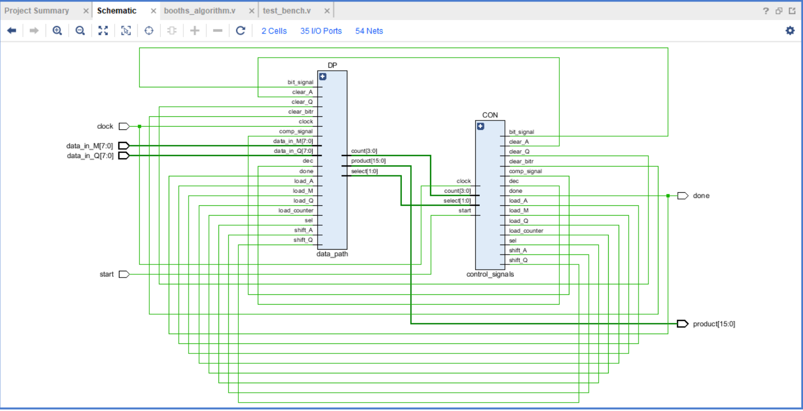

# Booths_Algorithm_Data_and_Control_paths:

# Monitor Output of the Test Bench:
# ------------------------------------------------------------
* Q = 8; M = -9
1. 0 A = xxxxxxxx, Q = xxxxxxxx,Product =      x
2. 15 A = 00000000, Q = 00000000,Product =      x
3. 25 A = 00000000, Q = 00001000,Product =      0
4. 35 A = 00000000, Q = 00001000,Product =      8
5. 45 A = 00000000, Q = 00000100,Product =      8
6. 55 A = 00000000, Q = 00000100,Product =      4
7. 65 A = 00000000, Q = 00000010,Product =      4
8. 75 A = 00000000, Q = 00000010,Product =      2
9. 85 A = 00000000, Q = 00000001,Product =      2
10. 95 A = 00000000, Q = 00000001,Product =      1
11. 105 A = 00001001, Q = 00000001,Product =      1
12. 115 A = 00000100, Q = 10000000,Product =   2305
13. 125 A = 00000100, Q = 10000000,Product =   1152
14. 135 A = 11111011, Q = 10000000,Product =   1152
15. 145 A = 11111101, Q = 11000000,Product =  -1152
16. 155 A = 11111101, Q = 11000000,Product =   -576
17. 165 A = 11111110, Q = 11100000,Product =   -576
18. 175 A = 11111110, Q = 11100000,Product =   -288
19. 185 A = 11111111, Q = 01110000,Product =   -288
20. 195 A = 11111111, Q = 01110000,Product =   -144
21. 205 A = 11111111, Q = 10111000,Product =   -144
22. 215 A = 11111111, Q = 10111000,Product =    -72
23. 225 A = 00000000, Q = 00000000,Product =    -72
24. 235 A = 00000000, Q = 00000000,Product =      0

# ------------------------------------------------------------
 Q = 6; M = 15
1. 0 A = xxxxxxxx, Q = xxxxxxxx,Product =      x
2. 15 A = 00000000, Q = 00000000,Product =      x
3. 25 A = 00000000, Q = 00000110,Product =      0
4. 35 A = 00000000, Q = 00000110,Product =      6
5. 45 A = 00000000, Q = 00000011,Product =      6
6. 55 A = 00000000, Q = 00000011,Product =      3
7. 65 A = 11110001, Q = 00000011,Product =      3
8. 75 A = 11111000, Q = 10000001,Product =  -3837
9. 85 A = 11111000, Q = 10000001,Product =  -1919
10. 95 A = 11111100, Q = 01000000,Product =  -1919
11. 105 A = 11111100, Q = 01000000,Product =   -960
12. 115 A = 00001011, Q = 01000000,Product =   -960
13. 125 A = 00000101, Q = 10100000,Product =   2880
14. 135 A = 00000101, Q = 10100000,Product =   1440
15. 145 A = 00000010, Q = 11010000,Product =   1440
16. 155 A = 00000010, Q = 11010000,Product =    720
17. 165 A = 00000001, Q = 01101000,Product =    720
18. 175 A = 00000001, Q = 01101000,Product =    360
19. 185 A = 00000000, Q = 10110100,Product =    360
20. 195 A = 00000000, Q = 10110100,Product =    180
21. 205 A = 00000000, Q = 01011010,Product =    180
22. 215 A = 00000000, Q = 01011010,Product =     90
23. 225 A = 00000000, Q = 00000000,Product =     90
24. 235 A = 00000000, Q = 00000000,Product =      0

# ----------------------------------------------------------------
# Simulation Output:

# ----------------------------------------------------------------

# Schematic Output:
